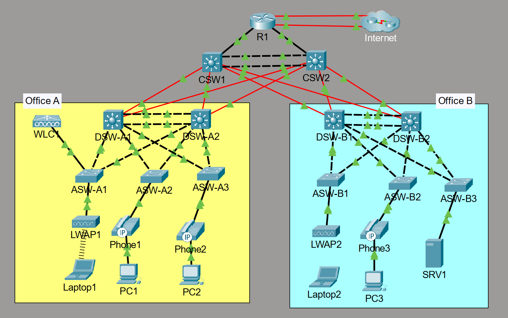

# CCNA Mega Lab

A hands-on enterprise networking project built in Cisco Packet Tracer, based on the Jeremy's IT Lab CCNA Mega Lab.

The project simulates a two-office enterprise network and demonstrates practical implementation of Layer 2 switching, Layer 3 routing, high availability, network services, security, IPv6, NAT, and wireless networking.

## Network Topology



The network uses a hierarchical enterprise architecture consisting of:

- Core Layer 3 switches
- Distribution Layer 3 switches
- Access switches
- Edge router
- Wireless LAN Controller (WLC)
- Lightweight Access Points (LWAPs)
- End-user, voice, server, and wireless networks

---

## Technologies & Key Implementations

### Layer 2

- VLANs
- 802.1Q Trunking
- Native VLAN
- DTP
- VTPv2
- Layer 2 EtherChannel
- PAgP / LACP
- Rapid PVST+
- STP Root Bridge
- PortFast
- BPDU Guard

### Layer 3 & Routing

- Inter-VLAN Routing
- SVIs
- Layer 3 EtherChannel
- HSRPv2
- OSPFv2
- OSPF Area 0
- OSPF Router IDs
- Passive Interfaces
- OSPF Default Route Advertisement
- Static Routing
- Floating Static Routes

### Network Services

- DHCP
- DHCP Relay
- DNS
- NTP
- SNMP
- Syslog
- FTP
- SSH

### NAT & Internet Connectivity

- Static NAT
- Dynamic PAT
- NAT Pool
- NAT ACLs
- WAN Failover
- Floating Default Route

### Security

- Standard ACLs
- Extended ACLs
- SSH Access Control
- Port Security
- Sticky MAC
- DHCP Snooping
- DHCP Rate Limiting
- Dynamic ARP Inspection
- BPDU Guard

### IPv6

- IPv6 Unicast Routing
- EUI-64
- IPv6 Static Routing
- Recursive Static Routes
- Fully-Specified Static Routes
- Floating IPv6 Routes

### Wireless

- Cisco WLC
- Lightweight APs
- WLAN / SSID Configuration
- Dynamic WLC Interfaces
- VLAN-based Wireless Networking
- WPA2 / AES
- PSK Authentication

---

## Network Design

### Office A

| VLAN | Purpose | Network |
|---|---|---|
| 10 | PCs | `10.1.0.0/24` |
| 20 | Phones | `10.2.0.0/24` |
| 40 | Wi-Fi | `10.6.0.0/24` |
| 99 | Management | `10.0.0.0/28` |

### Office B

| VLAN | Purpose | Network |
|---|---|---|
| 10 | PCs | `10.3.0.0/24` |
| 20 | Phones | `10.4.0.0/24` |
| 30 | Servers | `10.5.0.0/24` |
| 99 | Management | `10.0.0.16/28` |

HSRPv2 provides default gateway redundancy, while STP root placement is aligned with the HSRP Active routers.

---

## IP Addressing

Detailed device and interface addressing is documented in:

**[IP Addressing](documentation/ip-addressing.xlsx)**

---

## Network Services

- R1 provides centralized DHCP services for Office A and Office B.
- Distribution switches use DHCP relay to forward client requests to R1.
- SRV1 provides DNS, Syslog, and FTP services.
- R1 provides NTP services for the network infrastructure.
- SSH provides secure remote management with local authentication and VTY access restrictions.
- LLDP is used for neighbor discovery while CDP is disabled.

---

## Security Implementation

The lab implements both Layer 2 and Layer 3 security controls.

Key examples include:

- ACL-based traffic filtering between Office A and Office B
- SSH access restricted to the Office A PC subnet
- Port Security with Sticky MAC
- DHCP Snooping
- DHCP rate limiting
- Dynamic ARP Inspection
- PortFast and BPDU Guard

---

## Internet Connectivity & NAT

R1 provides Internet connectivity using:

- Static NAT for external access to SRV1
- Dynamic PAT using a NAT pool
- Primary and floating default routes
- WAN link failover

PAT is configured for the Office A PCs, Office A Phones, Office B PCs, Office B Phones, and Wi-Fi networks.

---

## IPv6

IPv6 connectivity is implemented on R1 and the Core switches as part of a dual-stack migration scenario.

The implementation includes EUI-64 addressing and primary/floating IPv6 default routes.

---

## Wireless

A Cisco WLC and LWAPs provide wireless connectivity through VLAN 40.

**SSID:** `Wi-Fi`  
**Security:** WPA2 / AES  
**Authentication:** PSK

> Packet Tracer limitations may affect wireless client DHCP behavior.

---

## Repository Structure

```text
CCNA-mega-lab/
│
├── README.md
│
├── documentation/
│   └── ip-addressing.xlsx
│
└── topology/
    ├── topology.png
    └── CCNA-mega-lab.pka
